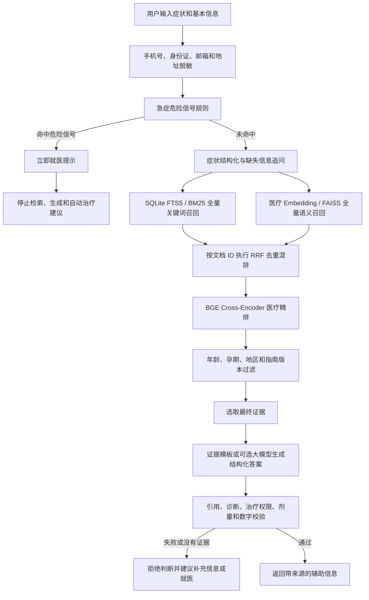
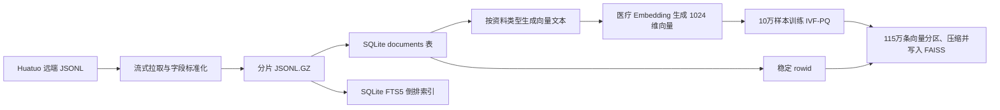
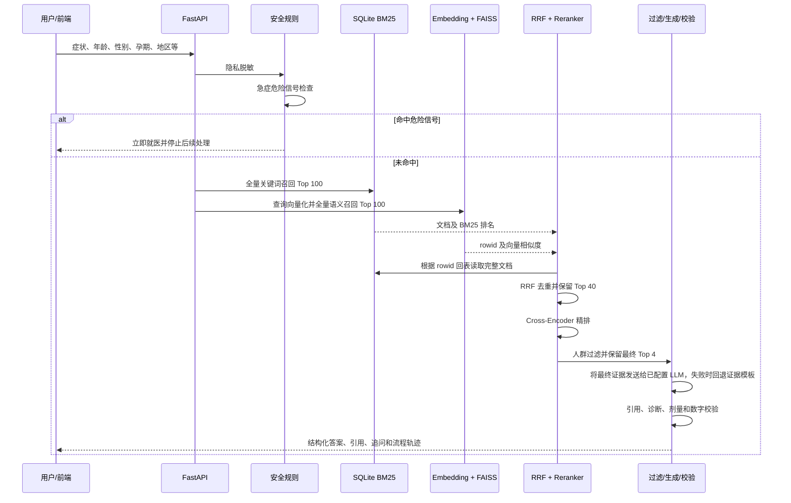

# 中文医疗混合检索与安全 RAG 系统

本项目是一个面向中文医疗问答的完整学习项目，覆盖数据拉取、数据标准化、百万级关键词索引、全量语义向量索引、混合召回、医疗精排、人群过滤、证据约束生成和生成后安全校验。

项目当前已经完成以下全量索引：

| 产物 | 当前规模 | 用途 |
|---|---:|---|
| Huatuo 知识图谱问答 | 796,444 条 | 疾病、症状、药物关系及基础问答召回 |
| Huatuo 医疗百科问答 | 362,420 条 | 疾病与症状基础知识召回 |
| 本地安全示例 | 10 条 | 急症、安全边界和策略演示 |
| SQLite 文档与 BM25 索引 | 1,158,874 条 | 保存原文并执行全量关键词召回 |
| FAISS 医疗向量索引 | 1,158,874 条 | 执行全量中文语义召回 |

> 本系统用于技术学习和医疗信息辅助检索，不提供诊断、处方或个体化治疗建议，不能替代医生，也不能直接作为医疗器械使用。

## 1. 为什么要使用这套架构

医疗问答不能只依赖大模型自身记忆，也不能把历史问诊答案直接当作当前治疗标准。本项目把职责拆开：

- 规则负责隐私处理和急症优先阻断；
- BM25 负责精确关键词、药名和医学名词匹配；
- Embedding + FAISS 负责口语表达与规范医学表达之间的语义匹配；
- RRF 合并两种不同检索方式，避免直接比较不可比的分数；
- Cross-Encoder Reranker 阅读查询和候选全文，进行第二次相关性判断；
- 人群过滤器检查年龄、孕期、地区和指南版本；
- 生成器只能使用最终候选证据；
- 校验器阻止无引用、无权限治疗、可疑剂量、证据外数字和确定性诊断。

项目不在检索逻辑里维护类似 `QUERY_EXPANSIONS` 的问题级同义词硬编码。安全规则、急症规则和治疗意图规则仍然使用显式规则，因为它们需要稳定、可审计、优先于模型执行。

## 2. 整体业务流程



### 2.1 急症为什么必须在检索之前

如果用户描述严重呼吸困难、疑似卒中、胸痛伴危险表现、大量出血、意识障碍、严重过敏、自伤风险，或者三月龄以下婴儿发热等情况，系统应优先提示急救，而不是先检索“可能是什么病”。

急症规则位于 `backend/app/services/triage.py`，命中后主流程立即返回，不运行 BM25、FAISS、Reranker 和生成器。

### 2.2 结构化和追问的作用

系统会从用户输入中整理症状、身体部位、持续时间、体温、年龄、性别、孕期和地区，并根据缺失信息最多生成四个追问。

当前检索仍然使用脱敏后的原始描述，不会把人工维护的同义词偷偷加入查询。结构化结果主要用于前端解释、人群过滤和后续扩展。

## 3. 离线数据处理流程

离线流程只在准备数据、更新数据或更换 Embedding 模型时运行。完成后，日常查询直接使用已经生成的 SQLite 和 FAISS 文件。



### 3.1 原始数据标准化

拉取脚本把不同上游字段统一成以下结构：

```json
{
  "id": "huatuo-encyclopedia-135902",
  "title": "饿了就胃痛怎么办",
  "question": "饿了就胃痛怎么办",
  "content": "完整回答正文",
  "source": "huatuo_encyclopedia_qa",
  "source_url": "数据来源地址",
  "source_type": "medical_qa",
  "trust_level": "secondary",
  "allow_treatment_generation": false,
  "regions": ["CN"],
  "retrieval_only": true
}
```

Huatuo 数据默认标记为：

- `trust_level=secondary`：二级参考资料；
- `retrieval_only=true`：允许参与检索；
- `allow_treatment_generation=false`：不能单独授权生成治疗方案、药品剂量或处方。

### 3.2 为什么使用 JSONL.GZ

- JSONL 每行是一条独立 JSON，可以流式读取；
- 某一行损坏时更容易定位，不必把百万条记录解析为一个巨大数组；
- Gzip 能显著减少磁盘占用；
- Python 可以直接使用 `gzip.open(..., "rt")` 读取，不需要先解压；
- 分片后可以断点下载、单独重跑或并行处理。

原始分片位于：

```text
backend/data/raw/*.jsonl.gz
backend/data/raw/manifest.json
```

### 3.3 SQLite 与 BM25 如何构建

`build_search_index.py` 会：

1. 流式读取普通 JSONL 和 `.jsonl.gz`；
2. 清理问题和回答字段；
3. 把原始资料写入 SQLite `documents` 表；
4. 对 `title + question + keywords` 生成中文单字、双字和英文数字词元；
5. 把词元写入 SQLite FTS5 虚拟表；
6. 使用同一个连续 `rowid` 关联文档表、BM25 和后续 FAISS；
7. 完成后把 `metadata.status` 更新为 `complete` 并原子发布文件。

SQLite 的主要字段：

| 字段 | 含义 |
|---|---|
| `rowid` | SQLite 和 FAISS 共用的稳定数字 ID |
| `document_id` | 数据源级稳定字符串 ID |
| `title` | 标题 |
| `question` | 用户问题或章节问题 |
| `content` | 完整回答或证据正文 |
| `source` / `source_url` | 来源名称和地址 |
| `source_type` | `medical_qa`、指南、说明书、规则等资料类型 |
| `trust_level` | 资料可信等级 |
| `allow_treatment_generation` | 是否允许参与治疗内容生成 |
| `regions` | 适用地区 |
| `minimum_age` / `maximum_age` | 适用年龄范围 |
| `pregnancy_allowed` | 是否适用于孕期 |
| `guideline_version` | 指南版本或年份 |
| `retrieval_only` | 是否仅允许检索参考 |
| `keywords` / `cautions` | 关键词和注意事项 |

## 4. 全量向量与 FAISS 流程

### 4.1 什么是 Embedding

Embedding 模型把文本转换成固定长度的数字向量。本项目默认模型输出 1024 维归一化向量。语义相近的问题在向量空间中通常距离更近，例如：

```text
饿了就肚子痛
空腹时胃痛怎么办
饥饿时上腹部疼痛
```

它们用词不完全相同，但 FAISS 仍可能把它们互相召回。

### 4.2 向量文本规则

当前规则版本是：

```text
source-aware-question-first-v1
```

不同资料使用不同向量文本：

| 资料类型 | 参与向量编码的内容 | 原因 |
|---|---|---|
| 医疗问答、问诊对话 | `question + title + keywords` | 让用户口语问题直接匹配资料问题，避免长回答稀释语义 |
| 指南、说明书、安全规则等证据文档 | `title + question + keywords + content_excerpt` | 非问答资料需要正文片段表达章节含义 |

完整回答不会丢失，仍然保存在 `knowledge.db`。FAISS 命中后通过 `rowid` 回到 SQLite 读取完整问题、回答、来源和人群条件。

### 4.3 什么是 FAISS

FAISS 是向量相似度索引，不是数据库、医疗数据或大模型。它负责从 1,158,874 个向量中快速找出与用户查询最接近的候选 ID。

当前索引结构：

```text
IndexIDMap2(IndexIVFPQ)
```

参数含义：

| 参数 | 当前值 | 作用 |
|---|---:|---|
| `dimension` | 1024 | Embedding 输出维度 |
| `nlist` | 2048 | IVF 聚类分区数量 |
| `nprobe` | 32 | 查询时探测的分区数量 |
| `pq_m` | 64 | 把向量拆为 64 个子空间压缩 |
| `pq_bits` | 8 | 每个子空间使用 8 bit 编码 |
| `code_size` | 64 字节/条 | 每条向量的 PQ 压缩码大小 |

如果保存全部原始 `float32` 向量，115万条1024维向量约需 4.7GB。当前 `medical.faiss` 经过 IVF-PQ 压缩后约 97MB。

### 4.4 为什么先训练10万条，再编码115万条

FAISS 建库分为两个阶段：

1. 从全量数据均匀采样100,000条，生成向量并训练2048个 IVF 分区和 PQ 压缩码本；
2. 对全部1,158,874条记录生成向量，确定分区，压缩后写入 FAISS，并绑定 SQLite `rowid`。

第一阶段只是学习“怎样分区和压缩”，第二阶段才是真正把全部资料写入索引。

## 5. 在线查询技术流程



### 5.1 BM25 独立召回

BM25 在全部 SQLite FTS5 文档上搜索，不依赖 FAISS 的候选集。它擅长：

- 药品名、疾病名、检查名等精确词；
- 用户问题和文档问题存在相同中文片段；
- 数字、英文缩写和特定医学术语。

默认召回 `BM25_TOP_K=100` 条。

### 5.2 FAISS 独立召回

用户查询先由与建库相同的医疗 Embedding 模型生成1024维归一化向量，再使用内积近似余弦相似度搜索全部 FAISS 索引。

FAISS 不是在 BM25 的100条结果中再次排序，而是在115万条向量上独立搜索，默认召回 `VECTOR_TOP_K=100` 条。

### 5.3 RRF 混合排序

BM25 分数与向量相似度的数值范围不同，不能直接相加。RRF 只使用每一路的排名：

```text
RRF(d) = 1 / (60 + rank_bm25) + 1 / (60 + rank_faiss)
```

同一文档同时被两路召回时会得到两次排名贡献，因此通常排得更靠前。系统按 `document_id` 去重，默认保留 `RRF_TOP_K=40` 条。

### 5.4 医疗 Reranker 精排

默认使用 `BAAI/bge-reranker-v2-m3` Cross-Encoder，把以下内容作为一对联合编码：

```text
用户查询
+
候选标题 + 问题 + 完整回答 + 关键词
```

Cross-Encoder 能看到查询和候选之间的细粒度交互，通常比只比较两个独立向量更精确。模型分数之后还会叠加可审计的来源可信度和治疗权限策略。

Reranker 只处理 RRF 的少量候选，不会在每次查询时读取全部115万条。

### 5.5 人群和版本过滤

精排后依次检查：

- 用户年龄是否处于资料允许范围；
- 孕期用户是否命中明确禁用资料；
- 用户地区是否与资料地区或 `GLOBAL` 匹配；
- 指南版本是否超过十年或无法解析。

当前 Huatuo 问答多数没有完整年龄、孕期和指南版本元数据，因此相关过滤逻辑已经实现，但只有未来接入结构化指南和说明书后才能充分发挥作用。

### 5.6 生成和校验

如果配置了 OpenAI 兼容接口，生成器要求模型：

- 只能使用提供的证据；
- 每项医学陈述带 `[S数字]` 引用；
- 不补充证据中没有的药名、剂量或诊断；
- 返回固定 JSON 结构。

未配置外部大模型或调用失败时，系统会使用完全可追溯的证据模板，不会伪装成大模型生成成功。

生成后校验包括：

- 引用标记是否存在、是否引用未知资料；
- 是否出现确定性诊断表达；
- 治疗请求是否有 `allow_treatment_generation=true` 的证据；
- 剂量是否获得高可信说明书授权；
- 输出数字是否能在候选证据中找到。

没有最终证据或任何阻断校验失败时，系统拒绝继续判断并返回原因。

## 6. 技术组件与职责

| 层级 | 技术 | 职责 |
|---|---|---|
| 前端 | Vue 3、TypeScript、TSX、Vite | 咨询表单、检索流程轨迹、证据和结果展示 |
| API | FastAPI、Pydantic | 参数校验、接口、生命周期和 CORS |
| 原文存储 | SQLite | 保存115万条问题、回答、来源和安全元数据 |
| 关键词检索 | SQLite FTS5、BM25 | 全量精确召回 |
| 文本向量化 | Transformers、PyTorch、医疗 BGE | 生成1024维归一化稠密向量 |
| 向量检索 | FAISS IVF-PQ | 全量语义召回与压缩索引 |
| 混排 | RRF | 合并两个不可直接比较的排名 |
| 精排 | BGE Reranker Cross-Encoder | 对有限候选执行深度相关性判断 |
| 生成 | 证据模板、可选 OpenAI 兼容接口 | 生成带固定引用的结构化回答 |
| 安全 | 显式规则与校验器 | 急症阻断、人群过滤、治疗权限和幻觉检查 |

### 6.1 macOS 模型进程隔离

Apple Silicon 上，PyTorch/MPS 和 FAISS 可能加载不同 OpenMP 运行时。项目没有设置 `KMP_DUPLICATE_LIB_OK` 绕过冲突，而是：

- 主进程加载 SQLite 和 FAISS；
- Embedding 在独立 `spawn` 子进程中运行；
- Reranker 在另一个独立 `spawn` 子进程中运行；
- 通过进程管道传递查询、候选和向量结果。

MPS 使用 Mac 统一内存。建库时模型权重、推理中间数据和系统内存共享，因此批大小越大，内存压力越高。

## 7. 目录和文件说明

```text
medical-rag-demo/
├── backend/
│   ├── app/
│   │   ├── main.py                       FastAPI 入口
│   │   ├── config.py                     环境变量配置
│   │   ├── models.py                     API 和检索数据模型
│   │   ├── pipeline.py                   完整在线主流程
│   │   └── services/
│   │       ├── privacy.py                隐私脱敏
│   │       ├── triage.py                 急症危险信号
│   │       ├── symptoms.py               症状结构化和追问
│   │       ├── persistent_index.py       SQLite FTS5/BM25
│   │       ├── embedding_text.py         分类型向量文本规则
│   │       ├── embedding.py              医疗 Embedding
│   │       ├── faiss_index.py            FAISS 在线查询
│   │       ├── retrieval.py              内存 BM25 和 RRF
│   │       ├── reranker.py               Cross-Encoder 精排
│   │       ├── filters.py                人群与版本过滤
│   │       ├── generator.py              证据约束生成
│   │       ├── validator.py              生成后校验
│   │       └── model_workers.py           MPS/Torch 模型进程隔离
│   ├── scripts/
│   │   ├── pull_huatuo.py                拉取并规范化 Huatuo 数据
│   │   ├── build_search_index.py         构建 SQLite/BM25
│   │   ├── build_faiss_index.py          构建全量 FAISS
│   │   ├── inspect_retrieval.py          检查四阶段排名
│   │   └── evaluate_retrieval.py         计算 Recall/MRR
│   ├── tests/test_pipeline.py             后端局部回归测试
│   └── data/
│       ├── raw/                           JSONL.GZ 分片和下载清单
│       ├── processed/
│       │   ├── knowledge.db               原文和 BM25，约1.6GB
│       │   ├── medical.faiss              向量索引，约97MB
│       │   └── medical.faiss.json         FAISS 构建清单
│       └── models/                        Hugging Face 模型缓存，约4.3GB
├── frontend/
│   ├── src/api/client.ts                  后端接口封装
│   ├── src/components/                    表单、流程、证据和结果组件
│   ├── src/types.ts                       前端业务类型
│   └── vite.config.ts                     开发代理到后端8000端口
└── README.md
```

`knowledge.db-wal` 和 `knowledge.db-shm` 是 SQLite 在 WAL 模式下可能产生的运行辅助文件，不是另一份医疗数据。

## 8. 从零构建项目

### 8.1 环境要求

- Python 3.12 推荐；
- Node.js 20.19 或更高版本；
- macOS Apple Silicon 可使用 MPS；
- Linux NVIDIA 环境可使用 CUDA；
- CPU 可以运行，但百万级向量化会明显更慢。

### 8.2 创建 Python 环境

```bash
cd /Users/codesun/ai-coding/medical-rag-demo

python3.12 -m venv .venv-full
source .venv-full/bin/activate
python -m pip install -r backend/requirements-full.txt
```

### 8.3 拉取全部 Huatuo 数据

```bash
python3 backend/scripts/pull_huatuo.py \
  --sources knowledge_graph encyclopedia \
  --limit 0 \
  --shard-size 50000
```

如果下载中断：

```bash
python3 backend/scripts/pull_huatuo.py \
  --sources knowledge_graph encyclopedia \
  --limit 0 \
  --shard-size 50000 \
  --resume
```

### 8.4 构建 SQLite 与 BM25

首次构建：

```bash
PYTHONPATH=backend .venv-full/bin/python \
  backend/scripts/build_search_index.py
```

需要明确覆盖旧文件时：

```bash
PYTHONPATH=backend .venv-full/bin/python \
  backend/scripts/build_search_index.py --force
```

重建 `knowledge.db` 后，SQLite `rowid` 或文档数量可能变化，因此必须同步重建 FAISS，不能继续使用旧向量文件。

### 8.5 首次构建全量 FAISS

macOS Apple Silicon：

```bash
caffeinate -i env \
  HF_HUB_OFFLINE=1 \
  PYTHONPATH=backend \
  .venv-full/bin/python backend/scripts/build_faiss_index.py \
  --device mps \
  --batch-size 64 \
  --fetch-size 2048 \
  --checkpoint-every 25000 \
  --document-max-length 256 \
  --training-sample-size 100000 \
  --nlist 2048 \
  --pq-m 64 \
  --pq-bits 8 \
  --force
```

`HF_HUB_OFFLINE=1` 只适用于模型已经下载完成的情况。第一次下载模型时应移除该变量。

Linux NVIDIA 环境把 `--device mps` 改为 `--device cuda`。内存不足时可以把 `--batch-size 64` 改为 `32` 或 `16`。

### 8.6 中断后继续 FAISS

第一次启动使用 `--force`；发生中断后，必须把最后一个参数改成 `--resume`：

```bash
caffeinate -i env \
  HF_HUB_OFFLINE=1 \
  PYTHONPATH=backend \
  .venv-full/bin/python backend/scripts/build_faiss_index.py \
  --device mps \
  --batch-size 64 \
  --fetch-size 2048 \
  --checkpoint-every 25000 \
  --document-max-length 256 \
  --training-sample-size 100000 \
  --nlist 2048 \
  --pq-m 64 \
  --pq-bits 8 \
  --resume
```

注意：

- `--force` 会丢弃旧 FAISS 和断点，从零开始；
- `--resume` 使用 `.building` 文件继续；
- 每25,000条保存一次断点；
- 模型、模型子目录、向量文本规则、最大长度和目标文档数必须匹配；
- 构建完成后 `.building` 会原子发布为正式文件。

## 9. 查看数据和检索结果

### 9.1 查看 FAISS 清单

```bash
.venv-full/bin/python -m json.tool \
  backend/data/processed/medical.faiss.json
```

`medical.faiss` 是二进制文件，不能作为 JSON 打开。人类通常查看构建清单和实际检索结果，而不是直接阅读压缩向量。

### 9.2 查看 SQLite 中的原始问答

```bash
sqlite3 -header -column backend/data/processed/knowledge.db \
  "SELECT document_id, question, substr(content, 1, 300) AS answer
   FROM documents
   WHERE question LIKE '%饿了%'
   LIMIT 10;"
```

### 9.3 并排检查四阶段检索

```bash
HF_HUB_OFFLINE=1 PYTHONPATH=backend \
  .venv-full/bin/python backend/scripts/inspect_retrieval.py \
  "饿了就肚子痛" --top-k 10
```

输出依次包括：

1. BM25 独立召回；
2. FAISS 独立召回；
3. RRF 混排；
4. Cross-Encoder 精排。

如果只想检查召回，不想加载约2GB的 Reranker 权重：

```bash
HF_HUB_OFFLINE=1 PYTHONPATH=backend \
  .venv-full/bin/python backend/scripts/inspect_retrieval.py \
  "饿了就肚子痛" --top-k 10 --skip-reranker
```

## 10. 启动后端和前端

### 10.1 环境变量

后端会自动加载 `backend/.env`，同时保留系统环境变量的更高优先级。先复制示例文件：

```bash
cp backend/.env.example backend/.env
```

常用配置：

| 环境变量 | 默认值 | 含义 |
|---|---|---|
| `SEARCH_INDEX_PATH` | `backend/data/processed/knowledge.db` | SQLite/BM25 文件 |
| `FAISS_INDEX_PATH` | `backend/data/processed/medical.faiss` | FAISS 二进制文件 |
| `FAISS_MANIFEST_PATH` | `backend/data/processed/medical.faiss.json` | FAISS 构建清单 |
| `MODEL_CACHE_DIR` | `backend/data/models` | 模型缓存目录 |
| `BM25_TOP_K` | `100` | BM25 独立召回数量 |
| `VECTOR_TOP_K` | `100` | FAISS 独立召回数量 |
| `RRF_TOP_K` | `40` | RRF 保留候选数 |
| `FINAL_TOP_K` | `4` | 最终证据数量 |
| `FAISS_NPROBE` | `32` | FAISS 查询探测分区数 |
| `EMBEDDING_MODEL` | `ming0302/bge-m3-medical-cn` | 查询和建库共用模型 |
| `EMBEDDING_MODEL_SUBFOLDER` | `model` | 模型仓库内子目录 |
| `RERANKER_MODEL` | `BAAI/bge-reranker-v2-m3` | Cross-Encoder 模型 |
| `MODEL_DEVICE` | `auto` | `auto`、`mps`、`cuda` 或 `cpu` |
| `LLM_BASE_URL` | 空 | OpenAI 兼容接口根地址或完整 `/chat/completions` 地址 |
| `LLM_API_KEY` | 空 | 接口密钥，禁止提交仓库 |
| `LLM_MODEL` | 空 | 兼容接口实际支持的模型名称 |
| `LLM_TIMEOUT_SECONDS` | `180` | 单次生成请求超时秒数 |
| `LLM_EVIDENCE_MAX_CHARACTERS` | `2500` | 每条最终证据发送给 LLM 的最大字符数 |
| `LLM_MAX_OUTPUT_TOKENS` | `1200` | 单次结构化回答最大输出 Token 数 |
| `LLM_ENABLE_THINKING` | 空 | 支持思考开关的接口可设为 `false`，其他接口留空 |
| `RETRIEVAL_LOG_TOP_K` | `10` | 每个检索阶段打印的最大候选数量 |
| `RETRIEVAL_LOG_CONTENT_CHARACTERS` | `300` | 每条检索结果打印的正文预览字符数 |

Embedding 查询模型必须与 `medical.faiss.json` 中的建库模型和子目录完全一致，否则服务拒绝加载向量索引。

### 10.2 启动后端

从项目根目录启动时，可以直接使用统一脚本：

```bash
pnpm dev:server
```

等价的后端命令如下；配置模块会自动读取 `backend/.env`，不需要额外传 `--env-file`：

```bash
HF_HUB_OFFLINE=1 MODEL_DEVICE=mps PYTHONPATH=backend \
  .venv-full/bin/python -m uvicorn app.main:app \
  --host 127.0.0.1 --port 8000
```

启动时会预热 Reranker；Embedding 查询模型在第一次向量查询时延迟加载。

配置完整并且最终证据非空时，系统会把脱敏后的用户问题、追问、最终 Top 4 证据的标题、来源、可信等级、治疗权限和正文发送给 LLM。前端“结构化答案生成”轨迹应显示 `configured-llm`；若显示 `evidence-template`，同一行会说明缺少的配置、HTTP 状态、网络错误或响应格式错误。

### 10.3 请求、检索和 LLM 日志

后端终端会按同一个 `request_id` 输出三类中文 JSON 日志：

```text
[用户输入] {"request_id":"...","symptoms":"脱敏后的用户描述",...}
[检索结果][BM25] {"request_id":"...","total":100,"candidates":[...]}
[检索结果][FAISS] {"request_id":"...","total":100,"candidates":[...]}
[检索结果][RRF] {"request_id":"...","total":40,"candidates":[...]}
[检索结果][Reranker] {"request_id":"...","total":40,"candidates":[...]}
[检索结果][最终证据] {"request_id":"...","total":4,"candidates":[...]}
[LLM请求] {"request_id":"...","url":"...","payload":{...}}
[LLM响应] {"request_id":"...","model":"...","content":"...","usage":{...}}
```

用户日志只记录隐私处理后的文本。LLM 请求日志包含实际提示词和证据，但不会记录 `Authorization` 请求头或 `LLM_API_KEY`。生产环境应根据医疗数据合规要求决定是否继续保留这些调试日志。

### 10.4 启动前端

```bash
cd frontend
npm install
npm run dev
```

打开：

```text
http://127.0.0.1:5173
```

Vite 会把 `/api` 请求代理到 `http://127.0.0.1:8000`。

## 11. API

| 方法 | 路径 | 说明 |
|---|---|---|
| GET | `/api/health` | 服务状态和版本 |
| GET | `/api/knowledge/stats` | 文档数量、来源、FAISS、Reranker 和 LLM 配置状态 |
| POST | `/api/consult` | 执行完整医疗安全检索链路 |
| GET | `/docs` | FastAPI 交互式接口文档 |

咨询示例：

```bash
curl -X POST http://127.0.0.1:8000/api/consult \
  -H 'Content-Type: application/json' \
  -d '{
    "symptoms": "饿了就肚子痛，吃点东西会缓解",
    "age": 28,
    "sex": "male",
    "pregnant": false,
    "region": "CN",
    "duration": "一周",
    "temperature": null,
    "additional_info": null
  }'
```

响应会包含：

- `blocked` 和 `urgency`：是否被安全链路阻断；
- `summary` 和 `sections`：结构化辅助信息；
- `citations`：资料来源和摘要；
- `follow_up_questions`：需要补充的信息；
- `structured_symptoms`：结构化症状；
- `pipeline`：每个阶段的状态、说明和耗时；
- `validation_issues`：生成后校验失败原因；
- `retrieval_mode`：本次实际使用的检索和精排方式；
- `generation_mode`：`configured-llm`、`evidence-template` 或急症分支的 `not-run`；
- `generation_model`：本次成功生成答案的模型名称，回退时为空。

## 12. 降级策略

系统不会把缺失组件静默伪装成完整链路：

| 缺失或失败组件 | 实际行为 |
|---|---|
| `knowledge.db` 不存在 | 加载少量示例数据，仅运行内存 BM25 |
| `medical.faiss` 不存在或不匹配 | 保留全量 SQLite BM25，FAISS 标记为 fallback |
| Reranker 模型不可用 | 使用词元重合度和医疗证据策略排序，并标记 fallback |
| 未配置 LLM 或调用失败 | 使用证据模板生成，标记 fallback，并在流程轨迹显示安全失败原因 |
| 没有候选或校验失败 | 阻断回答，返回拒绝原因和就医建议 |

可通过以下接口确认当前是否真正启用全量 FAISS 和 Reranker：

```bash
curl http://127.0.0.1:8000/api/knowledge/stats
```

## 13. 评测检索质量

单个示例只能说明某次检索看起来合理，不能证明整体准确率。正式评测应由医生或标注人员在检索逻辑之外维护 qrels：

```json
{"query":"口语化症状描述","relevant_document_ids":["医生确认相关的文档ID"]}
```

执行：

```bash
HF_HUB_OFFLINE=1 PYTHONPATH=backend \
  .venv-full/bin/python backend/scripts/evaluate_retrieval.py \
  --qrels /path/to/doctor-reviewed-qrels.jsonl \
  --top-k 20
```

脚本分别计算：

- BM25 Recall@K 和 MRR@K；
- FAISS Recall@K 和 MRR@K；
- RRF Recall@K 和 MRR@K；
- Reranker Recall@K 和 MRR@K。

评测查询和标准答案不能写入召回代码，否则得到的是针对样例的硬编码结果，不是真实泛化能力。

## 14. 测试

后端局部回归测试：

```bash
PYTHONPATH=backend .venv-full/bin/python \
  -m unittest discover -s backend/tests -v
```

前端类型检查：

```bash
cd frontend
npm run typecheck
```

## 15. 常见问题

### 15.1 模型加载出现 `UNEXPECTED` 是否失败

Embedding 模型仓库还包含稀疏检索和 ColBERT 相关权重，而当前项目只使用稠密向量主干给 FAISS。类似下面的提示不是本次稠密 FAISS 构建失败：

```text
colbert_linear ... UNEXPECTED
sparse_linear ... UNEXPECTED
```

最终应以是否出现 `模型已加载`、`全量 FAISS 索引完成`，以及清单中的 `status=complete` 为准。

### 15.2 为什么 FAISS 文件不能直接打开

`medical.faiss` 是经过 IVF-PQ 压缩的二进制索引，不是 JSON。应查看 `medical.faiss.json`、运行 `inspect_retrieval.py`，或者根据命中的 `document_id` 到 SQLite 查看原文。

### 15.3 为什么第一次查询较慢

Embedding 查询模型使用延迟加载，第一次 FAISS 查询需要从磁盘加载模型到 CPU、MPS 或 CUDA；后续查询会复用同一个模型进程。

### 15.4 为什么启动时内存占用较高

后端启动会预热 Reranker，第一次向量查询还会加载 Embedding。如果两者同时常驻，模型权重会占用数GB内存。学习环境可以通过 `--skip-reranker` 检查召回，正式运行则应根据机器内存调整部署方式。

### 15.5 为什么治疗问题经常被拒绝

当前115万条主体是 Huatuo 二级参考问答，默认没有治疗生成权限。它们可以帮助找到相关资料，但不能自动升级成处方或当前治疗标准。只有接入并正确标注当前指南、临床路径和药品说明书后，治疗生成才可能获得授权。

## 16. 已实现能力与仍需补充的内容

### 已实现

- 百万级 Huatuo 数据流式拉取和 Gzip JSONL 分片；
- 115万条 SQLite FTS5/BM25 全量关键词召回；
- 115万条医疗 Embedding/FAISS 全量语义召回；
- 分类型、问题优先的向量文本规则；
- RRF 去重混排和真实 Cross-Encoder 精排；
- 隐私脱敏、急症规则、症状结构化与追问；
- 年龄、孕期、地区和指南版本过滤框架；
- 证据约束生成、引用和治疗权限校验；
- 检索检查工具和外部 qrels 评测工具；
- Vue 3 前端与 FastAPI 接口。

### 仍需补充

- 国家卫健委指南、临床路径和中国药品说明书的正式采集与版本管理；
- 医生审核的急症规则和检索 qrels；
- 对体重、肝肾功能、合并用药和药物相互作用的结构化过滤；
- 更完整的许可证、更新时间和来源追溯；
- 持续的 Recall、MRR、安全召回率和错误案例评测；
- 生产环境鉴权、审计日志、限流、监控、加密和隐私合规。

## 17. 医疗和数据安全边界

- Huatuo 问答用于提高召回覆盖率，不应作为当前治疗标准答案；
- 具体治疗应引用当前有效指南、临床路径或药品说明书；
- 药物剂量必须结合地区、年龄、体重、孕期、肝肾功能和合并用药；
- 规则未命中不代表不存在急症，模型召回也不能替代专业分诊；
- 所有模型都可能漏召回、错排或生成错误，必须保留人工复核；
- 不要把真实患者姓名、联系方式、身份证、病历或密钥提交到仓库；
- 商业使用前必须重新核查每个数据集、论文和模型的许可证与原始数据权利。

## 18. 数据与模型入口

- [Huatuo-26M](https://github.com/FreedomIntelligence/Huatuo-26M)
- [Huatuo 知识图谱问答](https://huggingface.co/datasets/FreedomIntelligence/huatuo_knowledge_graph_qa)
- [Huatuo 医疗百科问答](https://huggingface.co/datasets/FreedomIntelligence/huatuo_encyclopedia_qa)
- [bge-m3-medical-cn](https://huggingface.co/ming0302/bge-m3-medical-cn)
- [bge-reranker-v2-m3](https://huggingface.co/BAAI/bge-reranker-v2-m3)
